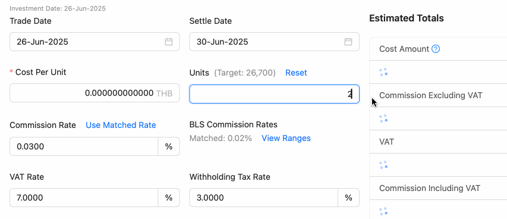

# Dealing > Allocation Page Changes

This time there are a lot of changes (both logic errors and user experience problems) that it is challenging to be listed as Line messages. Please read through this document to understand the changes.

## Previous Problems

### 1. Cost must be summed up from the bottom

Currently, this page shows the Cost calculation as a simple multiplication of the Cost per Unit and the Quantity, and the Cost box is editable.

But in reality, total cost is obtained from **individual resulting transactions** (one portfolio, one security), **summed up from the bottom**. Using multiplication (and the UI showing "x" and "=") is misleading.

Cost are often equal calculating either from the bottom or from the top, but not always. We were sometimes reported that the total cost in this page differs from the actual cost sent back from the broker by 0.01. (And therefore the need to have the Cost box be editable with the pencil button) That error is from the **accumulation of rounding differences** if the cost were calculated from the bottom.

This shows the cost that you get when calculating from the bottom. There are two entries that were rounded up by 0.005, so they accumulated to 0.01 difference.

The correct cost should be 95804.74, but the UI shows the multiplication result of 95804.73. **UI should be changed to reflect the correct cost calculated from the bottom.**

We found that the Cost difference problems were reported mostly when there are a lot of transactions created from one order (like 30+ transactions) because it is more possible for rounding differences to accumulate to show up on significant digits. (two decimal places in THB)

### 2. Bottom-Up Simulation Issues

However, the bottom-up calculation only works if the unit allocation back to the portfolio is **expected** to be exactly as ordered. Therefore, the following situations cause problems because allocation (manual work that must be done by the Dealer) is unknown at this stage:

- Units are not 100% executed.
- Units are 100% allocated, but the order was placed to multiple brokers, and this is not the only one.

To illustrate this problem, supposed that the Broker only managed to execute **48,000 units instead of 48,200 units** (17,700 + 19,400 + 5,500 + 5,600).

If after this stage the missing 200 units are removed from transaction #2 and #4 each, there are now a total of four 0.005 rounding errors, accumulated to 0.02 difference.

But if the Dealer chooses to remove 200 units from transaction #1 and #3 instead?  Now rounding differences are all canceled out.

What should the UI show in this case then? I think it is best that UI **falls back** to use the old top-down calculation (48,000 * 1.98765 = 95,407.2), and **makes it clear to the user** that this is now an **estimate** instead of **expected** cost value. The real total cost value will change depending on how the Dealer allocates back the units after this step.

Changes that will be made:

- The Cost box is now read-only (there should be no need to use the pencil button if costs are correctly calculated from the bottom), and will **try** to calculate the cost from the bottom. Falls back to the top-down calculation if the allocation is unknown.
- Removing the "x" and "=" UI language from the Cost box because it is misleading. Instead, UI must explicitly show that it is a **simulation**.
- Explicitly state that the Cost is a simulation and is of the type **EXPECTED** (correct as long as units are allocated back as ordered) or **ESTIMATED** (calculated top-down).

### 3. Same for Commission Cost and VAT Cost

The "Commission (excluding VAT&WHT)" needs the same treatment. (Summed up from the bottom, based on cost, and is rounded too.) It will no longer be editable, and the UI has to make it clear that it is a **simulation** of the Commission Cost, and will show the type of simulation (EXPECTED or ESTIMATED).

We can show an additional "VAT" box, which is calculated from rounded commission and is also rounded. Same rounding diff accumulation occurs.

In total, each transaction is **rounded three times**. All the rounding difference adds up. (Therefore, if an order is allocating back to 10 portfolios, rounding occurs 30 times, for example.) Rounding differences of commission and VAT are tiny, and may randomly go both ways which may cancel each other out, but sometimes they can accumulate to a significant amount when there are many transactions.

The new simulated total value UI should be able to account for all these accumulating rounding differences, that the top-down multiplication preview didn't account for.

### 4. Dealer cannot see the complete picture of the order when working on one placed order

In this image, the order is 48,200 units (17,700 + 19,400 + 5,500 + 5,600) and is placed to only one broker. The "Members" section can show the full picture of the order just fine, because that's all the units that were ordered.

What if we place 20,000 units to one broker, and the remaining 28,200 units to another broker?

The "Member" part looked the same because both are a part of the same order. Only the target is different because they are no longer 100% of the order. This partial target causes imperfect allocation that the Dealer must manually do. (And cause the total cost simulation to be estimated instead of expected, as explained earlier, even if both brokers fully executed them.)

In this case, it is somewhat trivial to picture in your head that the other one must be 28,200 units. But it is not always the case:

- What if we placed the order to three or more brokers instead? Now you cannot tell what the remaining 28,200 units are going to what broker.
- What if there are unplaced orders left? For example, placed 20,000 units to one broker, placed 10,000 to another broker, and the remaining 18,200 units are unplaced.

The changed UI will allow you to see all the "sibling" placed orders that you aren't working with, along with unplaced orders.

### 5. It was unclear whether auto-allocation was performed or not

We have a logic where if:

- The order is only placed to one broker.
- The placed order is 100% executed.

The auto-allocation of the units back to the portfolio is performed without any input from the Dealer. The dealer can re-adjust this allocation (with the second button) or just confirm using the auto-allocated units (with the third button).

When both criteria are **not** met, the auto-allocation is not performed, and the Dealer must manually allocate the units back to the portfolio. When this occurs, only the second button is enabled after dealing. The third button is disabled, meaning that Dealer must manually allocate the units before they can confirm.

This image shows the simple case of an order only placed on one broker, and the placed order is 100% executed. The auto-allocation is performed, and the Dealer can confirm immediately using the third button.

This image is still the simple case of an order placed to one broker, but the placed order is not 100% executed. The auto-allocation is not performed (200 units short), and the Dealer must manually allocate the units before they can confirm.

This image shows the case of placing an order to two brokers. They are both 100% executed, but each one is still a partial of full order and allocation cannot be predicted, so the auto-allocation is not performed. Only the second button is enabled.

The whole second button / third button being disabled or not are too transparent to the user to interpret what just happened. I will make the UI explicitly state whether the auto-allocation is performed or not.

### 6. Allocate modal needs the same cost simulation change

This top section of the Allocate modal is also using the "x" and "=" UI language, which is misleading as we are changing to bottom-up calculation.

There is a difference in this modal compared to previously. It is possible to change from either "Expected" or "Estimated" to **"Exact"** as soon as user decided where those leftover units (200 in this case) are going to be allocated. I will make the UI react to the allocation of the user in real time. (The simulation can revert to non-exact state reverts if the user withdrawn units from the allocation.)

### 7. Confirm modal needs the same cost simulation change

Same problem with the "x" and "=" UI language. In this modal, the cost calculation is always **"Exact"** because user had finished allocating for sure to be able to open this modal. Dealer can trust all the values being accurate to the resulting TXs after they confirm.

### 8. Auto-confirm transactions dialog 

This dialog provides a convenient way to confirm all transactions immediately if the Dealer is not planning to adjust their commission costs individually. But:

- It was shown after confirming from the "Allocate" modal (second button), but not shown after confirming in the "Confirm" modal (third button).
- It should reiterate how many transactions were created.

### 9. Broker Commission Rate problems

We can create tiered broker commission rates in the Resources module, which will automatically get used in the Dealing dialog as you type the units. (Tiered by units ordered, for example, 0 to 100,000 units = 0.1%, 100,001 to 200,000 units = 0.2%, etc.)

However, there are problems:

- When units are entered above the upper border of the highest tier, the UI uses a commission rate of 0.0% instead of the highest tier rate.
- It is hidden: User should be able to see all the tiers and how they are applied.
- The changes are silent: If a user had typed something in the commission rate box, but they go back to edit the units, the commission rate box is cleared or changed without any warning. We better have user manually take action to "apply" the tier's commission rate to the box for better user agency.

This image illustrates the problem. Note how the rate forcefully changes as you type in a not very noticeable way. Also note the error that the UI set the rate to 0.0% when the units are above the highest tier.

## Solutions

### Dealing Modal

The top portion now shows the ID of the order that this placement came from. You can also see the total units of that order at all times, and how that was distributed in two different ways: to portfolios, and to brokers. The first item of the broker distribution (bold font) is the one you are currently viewing. It can also display unplaced units of that order. Therefore, they always sum up to the total units of the order.

See the following images for all three cases: 1. Placed to one broker, 2. Placed to two brokers, and 3. Placed to two brokers and also having unplaced orders.

The Cost Per Unit and Units now have the "x" and "=" signs removed to make it clear that the totals on the right side are simulation. Cost Per Unit box now additionally shows the currency code and gains the "Reset" text-button you can click to reset the value to the target (100% execution). This button is also important in reminding you that you had changed the value to be different from the target.

Cost Per Unit gains input validation to prevent submission when the value is still 0. Unit box also gains validation that it must be a positive integer, but not higher than the target units of this placed order. Previously these are validated after you press the "Deal" button.

As you type in the Units box, if the broker you are working with has a tiered commission rate, the Commission Rate box below will no longer silently change like before. Instead, a new, read-only matched rate display will change. A text "Use Matched Rate" will appear to notify you that the current rate in the box is no longer matching, and you can click on it to manually apply the matched rate to the box.

Click the new "View Ranges" button to understand all the tiers, along with what tiers you are currently in according to the units you entered.

As explained earlier, we can either get EXPECTED or ESTIMATED total values depending on situations. The heading will tell you this. This image shows "Expected Totals" because the order is placed to one broker, and the units are 100% executed.

Additionally, you can press this "Show Details" button to see how it computes the total values bottom-up.

In the opened dialog you can see that the unit column title is "Expected Units," because technically at this step, Dealer had not decided how to allocate the units back to the portfolio yet. But these values are almost surely the case because the order was fully executed, and there is no reason to change these numbers from shown.

There is even a "Rounding Diff" column that shows the accumulated rounding differences from all transactions. Recall that each row will be rounded three times. In this image, you can see that rounding 12 times does accumulate to higher than 0.01 difference, compared to computing top-down. "Price Scale" shows the number of decimal places that the price is rounded to, each time, which is 2 in this case (THB).

As soon as units are changed to be less than 100% executed (missing 700 units in this case), the Cost Per Unit and Units will change to "Estimated Totals." The "Show Details" button will also disappear because the bottom-up calculation is no longer possible. How could it know what Dealer will do with the missing 700 units, which will affect total values, at this stage?

Cost Amount simulation box additionally gains the "?" icon to remind you that it had become an estimate, a simple top-down multiplication of the Cost Per Unit and Units.

After pressing the "Deal" button in the Dealing modal, the result notification now is able to tell you whether it had performed the auto-allocation or not.

Previously you had to only look at the buttons on the right side of the row. Since you can skip to the third confirm button right away, it means it had performed the auto-allocation.

This is displayed if auto-allocation was not performed. You must manually allocate the units before you can confirm.

Accordingly, the buttons on the right side of the row block the third confirmation button, forcing you to manually allocate the units first.

Lastly, like the previous version, the first button can be pressed again even if the placed order is already in the DEALT or ALLOCATING step to Deal the placed order again. (Perhaps to correct mistakes.) In the updated Dealing modal, the Deal button changes to Deal Again to clarify this. Behavior remains the same.

### Allocate Modal

The top part of this modal now shares the same information as in the Dealing modal, except data that was a form are now read-only and in tabular format instead of greyed out forms. Remaining units to be allocated now gains a progress bar that changes its color to green when perfectly allocated (now able to press Allocate and Confirm button), and red when over allocated.

This example shows the case of units not fully executed (missing 700 units). Notice that we have the "Estimated Totals" like the previous dialog. What has changed in this dialog is that the allocations that were unknown and force us to estimate the total values are going to be known as soon as the Dealer decided on the allocation right in this dialog.

In this image, after the "Auto" button did its best, there are 300 units left. The totals are still estimated from a simple top-down multiplication of the Cost Per Unit and Units.

As soon as the last 300 units are allocated, the total table is instantly updated to just "Totals" indicating that the values are now exact. Notice that VAT total is different from the estimates before.

If the Dealer decided to allocate those 300 units differently, it is possible for the exact "Totals" to end up different due to being a bottom-up calculation. (Notice the 0.01 difference of VAT from the last example) 

As always, you can press "Show Details" to see the exact calculation of the totals.

"Allocate by Settings" button (customizable way of auto-allocation) now has a better explanation of how it works.

The same detailed allocation mode explanations are provided in the Allocation Size page of Dealing module where you can set the allocation settings used in this "Allocate by Settings" button.

The success dialog with a shortcut to instantly confirm the created transactions, now reports how many transactions were created.

### Confirm / Unconfirm Modal

This is a modal opened from the third button on the row. It gets the same information upgrade as the Allocate modal.

In this modal, it is only possible for the totals to be "Exact" because this modal can only be opened in the case of units already allocated.

You now get the same TX confirmation shortcut dialog when pressing Confirm in this modal. It was not the case in the previous version.

